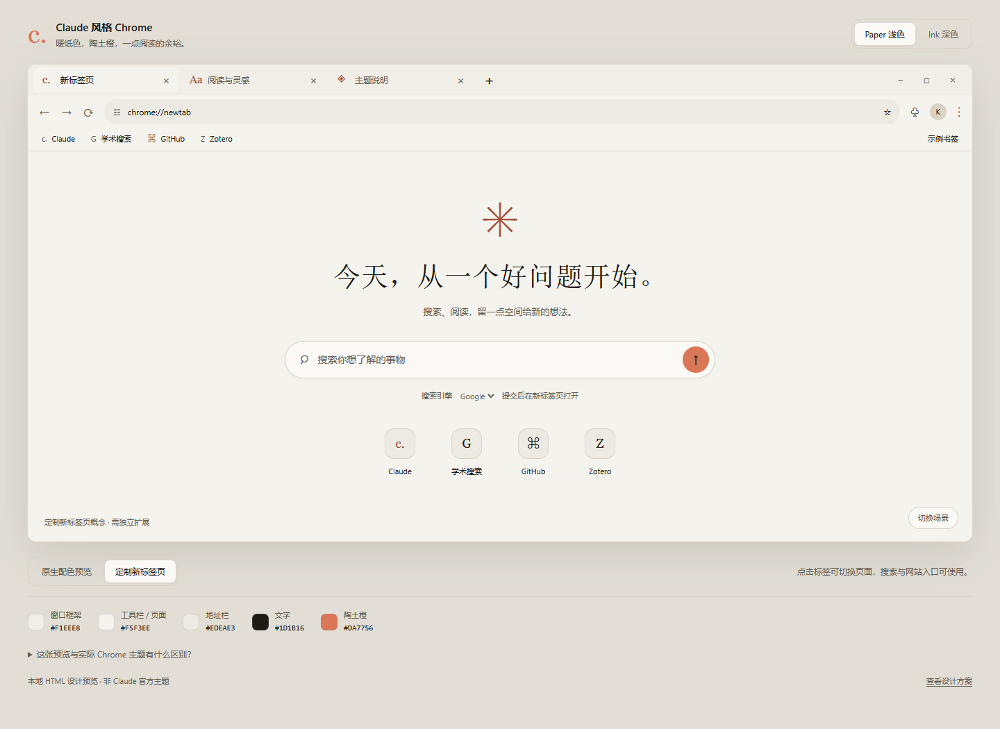
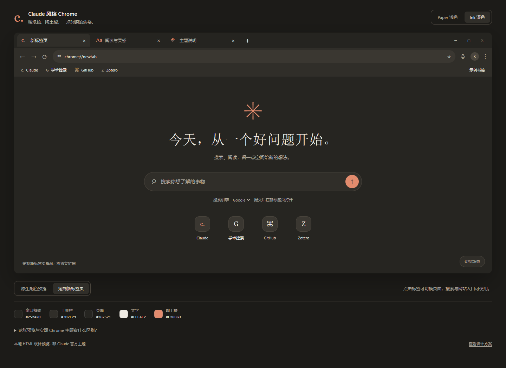

# Claude-inspired Chrome Theme

A warm, reading-focused Chrome theme in two variants: **Paper** (light) and **Ink** (dark). The palette uses warm paper, deep brown, and a restrained terracotta accent (`#DA7756`). This is an independent, unofficial project; it is not affiliated with Anthropic or Claude.

## Preview

These images are captures of the interactive HTML design demo. Chrome renders its own tabs, window controls, and New Tab page, so the installed theme may differ in those details.

| Paper | Ink |
|---|---|
|  |  |

Open [demo.html](demo.html) locally to compare the palettes and the two New Tab concepts. The demo is not an extension and is not installed with either theme.

## Install

1. Download this repository and extract it, or clone it.
2. In Chrome, open `chrome://extensions` and turn on **Developer mode**.
3. Choose **Load unpacked** and select the [`theme-paper`](theme-paper) or [`theme-ink`](theme-ink) directory.
4. Open a new window to inspect the frame, active and inactive tabs, toolbar, and New Tab page.

Only one Chrome theme can be active in a profile at a time. To switch variants, load the other theme directory. To restore Chrome's original appearance, use **Settings → Appearance → Reset to default**. When editing an installed unpacked theme, click its **Reload** button on `chrome://extensions`.

## What is included

| Path | Purpose |
|---|---|
| [`theme-paper/manifest.json`](theme-paper/manifest.json) | Installable light Chrome theme |
| [`theme-ink/manifest.json`](theme-ink/manifest.json) | Installable dark Chrome theme |
| [`demo.html`](demo.html) | Interactive visual preview |
| [`assets/claude-style.css`](assets/claude-style.css) | Optional Claude-inspired CSS for the separate web UI it was written for |

The CSS is not part of the Chrome theme. Its wallpaper variable defaults to `none`; if you use that CSS in its target UI, you can set `--cv-wallpaper` to your own image URL. The original selectors target a specific Material UI-based interface and are not a general Chrome stylesheet.

## Limits

Chrome themes can change supported browser colors, including the frame, tabs, toolbar, and New Tab background. They cannot restyle arbitrary websites, replace the favicon of `chrome://settings`, recolor only the Extensions puzzle icon, or fully control the Windows minimize/maximize/close buttons. The `buttons` tint is a hint to Chrome; `toolbar_button_icon` is also set, so the terracotta tint may not visibly affect every icon or state.

This repository does not contain a New Tab override extension. A different extension may still replace your New Tab page with Bing or another site; that behavior is independent of these themes.

Theme manifests are Manifest V3 and request no browser permissions. See [Chrome's theme documentation](https://developer.chrome.com/docs/extensions/develop/ui/themes) and [New Tab override documentation](https://developer.chrome.com/docs/extensions/develop/ui/override-chrome-pages).
