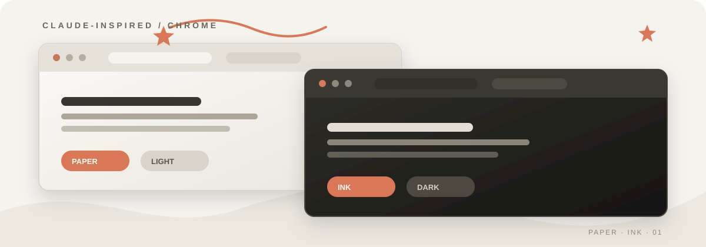
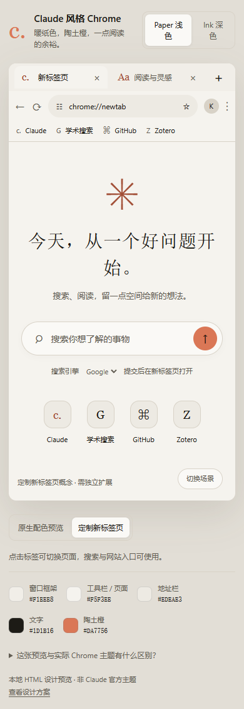
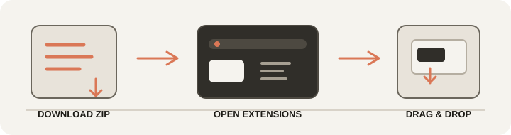

  
   
  
<strong>A quiet Chrome palette for focused browsing.</strong> Warm paper, deep ink, and a single terracotta signal.

  

    
    
    
  

  <a href="https://github.com/ForeverKaiXi/chrome-claude-theme/stargazers">Give it a star</a>
  ·
  <a href="https://github.com/ForeverKaiXi/chrome-claude-theme/issues">Report an issue</a>
  ·
  <a href="demo.html">Open the visual demo</a>

## Preview

Two restrained variants for the same browser mood: **Paper** for daylight reading and **Ink** for a quieter dark frame. The screenshots come from the included interactive demo; Chrome still owns its native tab strip, window controls, and New Tab behavior.

<table>
  <tr>
    <td width="50%"></td>
    <td width="50%"></td>
  </tr>
  <tr>
    <td align="center"><strong>Paper</strong> · warm light</td>
    <td align="center"><strong>Ink</strong> · deep dark</td>
  </tr>
</table>

  

## Download the themes

The current release is <strong>1.0.2</strong>. Each package is a self-contained Chrome theme ZIP with a root-level <code>manifest.json</code>.

| Variant | Mood | Download |
|:--|:--|:--|
|  <strong>Warm Paper</strong> | Light, warm, paper-like | [Download v1.0.2](./dist/warm-paper-chrome-theme-1.0.2.zip) |
|  <strong>Warm Ink</strong> | Dark, calm, ink-like | [Download v1.0.2](./dist/warm-ink-chrome-theme-1.0.2.zip) |

Older builds remain available in the [dist archive](./dist) for reproducibility:

Show v1.0.0 and v1.0.1 packages

| Variant | v1.0.1 | v1.0.0 |
|:--|:--|:--|
| Warm Paper | [ZIP](./dist/warm-paper-chrome-theme-1.0.1.zip) | [ZIP](./dist/warm-paper-chrome-theme-1.0.0.zip) |
| Warm Ink | [ZIP](./dist/warm-ink-chrome-theme-1.0.1.zip) | [ZIP](./dist/warm-ink-chrome-theme-1.0.0.zip) |

## Install by drag-and-drop

  

1. Download one of the ZIP files above. The latest Paper and Ink packages are recommended.
2. Open <code>chrome://extensions</code> in Chrome.
3. Turn on **Developer mode** in the upper-right corner.
4. Drag the downloaded <code>.zip</code> file onto the Extensions page.
5. Open a new tab and choose the theme if Chrome presents a confirmation step.

Only one Chrome theme can be active in a profile at a time. To switch variants, drag the other ZIP onto the same page. If a Chrome build does not accept the ZIP by drag-and-drop, extract it first and use **Load unpacked** to select the folder containing <code>manifest.json</code>.

## What is inside

<table>
  <tr>
    <td width="25%" align="center"> <strong>Native frame</strong> <small>Tabs, toolbar, frame, and New Tab colors.</small></td>
    <td width="25%" align="center"> <strong>Two moods</strong> <small>Paper light and Ink dark, sharing one accent.</small></td>
    <td width="25%" align="center"> <strong>Simple install</strong> <small>Download, open Extensions, drag the ZIP.</small></td>
    <td width="25%" align="center"> <strong>No permissions</strong> <small>Manifest V3 theme-only packages.</small></td>
  </tr>
</table>

| Path | Purpose |
|:--|:--|
| [theme-paper/manifest.json](theme-paper/manifest.json) | Installable light Chrome theme source |
| [theme-ink/manifest.json](theme-ink/manifest.json) | Installable dark Chrome theme source |
| [dist/](dist) | Versioned ZIP packages for drag-and-drop installation |
| [demo.html](demo.html) | Interactive visual preview |

The theme packages are deliberately small and contain no page scripts or browser permissions.

## Star history

  

This live chart is generated by [Star History](https://star-history.com/) and updates as the repository receives stars. It is intentionally data-driven rather than a made-up progress graphic.

## Privacy and scope

This is an independent, unofficial project. It is not affiliated with Anthropic or Claude.

Chrome themes can change supported browser colors, including the frame, tabs, toolbar, and New Tab background. They cannot restyle arbitrary websites, replace the favicon of <code>chrome://settings</code>, recolor only the Extensions puzzle icon, or fully control the Windows minimize/maximize/close buttons. The <code>buttons</code> tint is a hint to Chrome; <code>toolbar_button_icon</code> is also set, so the terracotta tint may not visibly affect every icon or state.

This repository does not contain a New Tab override extension. A different extension may still replace your New Tab page with Bing or another site; that behavior is independent of these themes.

Theme manifests are Manifest V3 and request no browser permissions. See [Chrome's theme documentation](https://developer.chrome.com/docs/extensions/develop/ui/themes) and [New Tab override documentation](https://developer.chrome.com/docs/extensions/develop/ui/override-chrome-pages).
